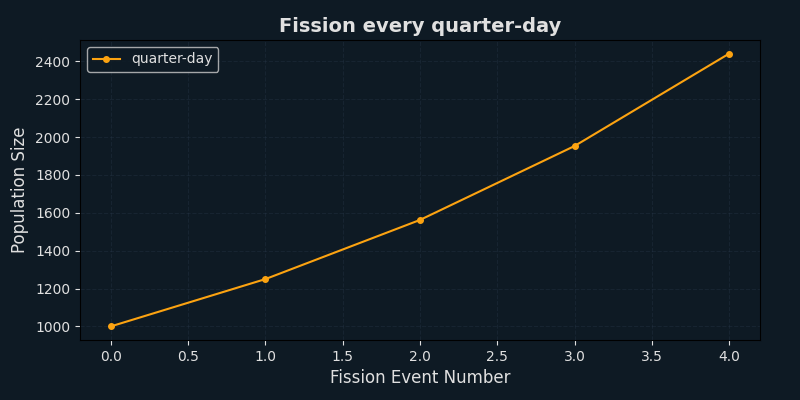
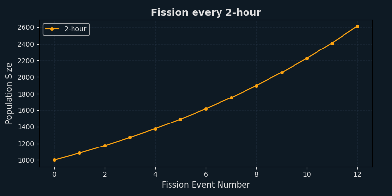
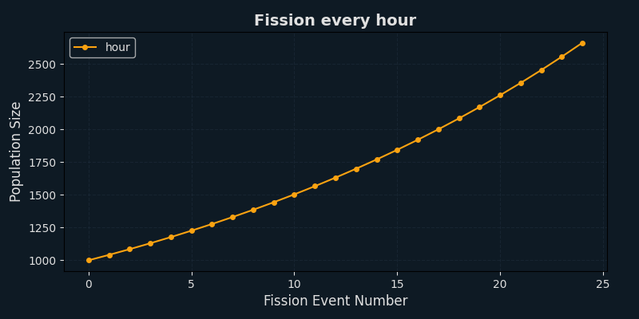
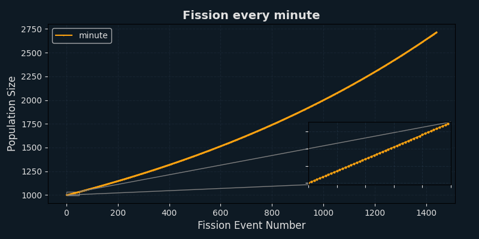
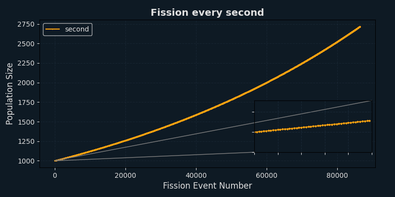

# Year 9 Mathematics Investigation - Computational Algorithms for Modeling Population Growth

This Python project models bacterial population growth using algorithms suited for real-world microbiology research. It's designed to simulate fission events under various conditions and visualize growth patterns clearly.

---

## 📦 Features

- 📊 **Naive vs Sophisticated** model comparison
- ⏱️ Time to reach a **target population**
- 🧬 Side-by-side **sophisticated model comparison**
- 📋 Detailed **projection tables** showing population changes per step
- 📈 Graphical simulation of **fission frequency changes** with:
  - Dark-mode graphs
  - Zoomed-in insets for dense data ("minute", "second")

---

## 🧪 Modules

```text
(1) Compare naive and sophisticated models
(2) Time to reach a target population
(3) Compare two sophisticated models
(4) Generate detailed projections
(5) Simulate increase in fission frequency
```

---

## 🚀 Getting Started

1. Run the program:

```bash
python main.py
```

2. Follow the prompts in the terminal.

Graphs will be saved to the `graphs/` folder with timestamped filenames.

---

## 📂 Folder Structure

```
/graphs        → auto-generated graph images (ignored by Git)
/main.py       → main program
/.gitignore    → excludes graphs folder from tracking
/README.md     → this file
/slides.pdf    → presentation slides (optional)
```

---

## 🛠️ Dependencies

Install required packages:

```bash
pip install matplotlib tabulate termcolor
```

---

## 📷 Example Graphs

### Fission Every Quarter-Day



Population doubles every 6 hours — clear exponential growth pattern.

### Fission Every 2 Hours



Growth is slightly smoother than quarter-day, with more steps.

### Fission Every Hour



Finer-grained growth: more consistent curve forming.

### Fission Every Minute



Very small changes per step — zoomed inset shows early growth stages.

### Fission Every Second



Extremely small growth increments — almost continuous curve.

---

## 📑 Presentation Slides

View the design and explanation slides here:

**[🔗 Download presentation slides (PDF)](Math_Investigation_Presentation_Detailed.pptx)**

placeholderforwhenimakepowerpoint

---

## 👤 Author

André  
Year 9 PMS Student  
Mathematics Investigation Semester 1 2025  
