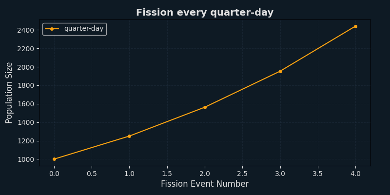
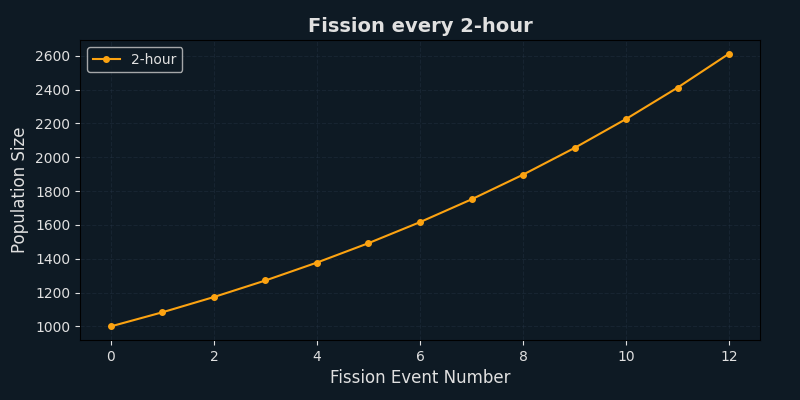
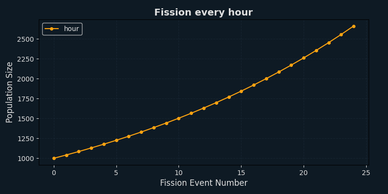
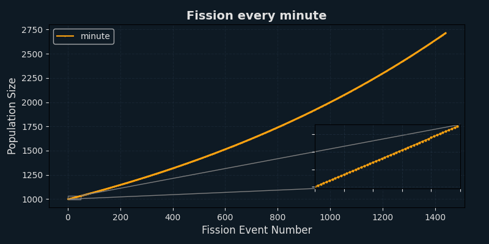
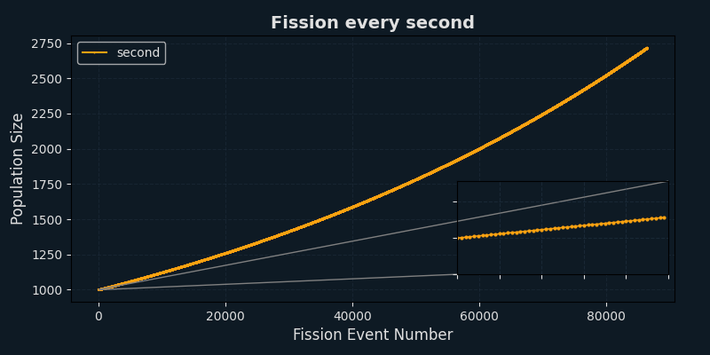

# Year 9 Mathematics Investigation - Computational Algorithms for Modeling Population Growth

This Python project models bacterial population growth using algorithms suited for real-world microbiology research. It's designed to simulate fission events under various conditions and visualize growth patterns clearly.

---

## 📦 Features

- 📊 **Naive vs Sophisticated** model comparison
- ⏱️ Time to reach a **target population**
- 🧬 Side-by-side **sophisticated model comparison**
- 📋 Detailed **projection tables** showing population changes per step
- 📈 Graphical simulation of **fission frequency changes** with:
  - Dark-mode graphs
  - Zoomed-in insets for dense data ("minute", "second")

---


## 🧪 Modules

```text
(1) Compare naive and sophisticated models
(2) Time to reach a target population
(3) Compare two sophisticated models
(4) Generate detailed projections
(5) Simulate increase in fission frequency
```

### 🔢 Module 1 – Compare Naive and Sophisticated Models  
You enter values for both models (initial population, growth rate, time unit, etc.).  
It then calculates how large the population would grow after a chosen amount of time using:
- **Naive** model: simple linear growth  
- **Sophisticated** model: compound growth with fission frequency  
Both results are displayed for comparison.

### 🎯 Module 2 – Time to Reach a Target Population  
You input a target population and model parameters.  
The program simulates growth using the **sophisticated model**, repeating small steps until the population reaches the target.  
It prints how many fission events (and how much time) it took to get there.

### ⚖️ Module 3 – Compare Two Sophisticated Models  
You enter values for two different sophisticated models.  
The program simulates both models over the same time period and shows how their final populations compare.  
This helps explore how fission frequency or growth rates affect outcomes.

### 📋 Module 4 – Generate Detailed Projections  
You can choose a population target or time-based projection.  
The program prints a table that shows, for every fission event:
- Opening population  
- Growth added  
- Closing population  
It's useful for visualizing how small changes accumulate over time.

### 📈 Module 5 – Simulate Increase in Fission Frequency  
This module models what happens if you increase how often fission happens.  
It simulates 5 scenarios:
- quarter-day  
- 2-hour  
- hour  
- minute  
- second  
For each one, it generates a graph and saves it in the `graphs/` folder.  
Graphs for "minute" and "second" include zoomed-in views to highlight small changes.


---

## 🚀 Getting Started

### 📥 Install from GitHub Release

1. Go to the [Releases page](https://github.com/AndreNijman/Computation-Algorithms-for-Modelling-Population-Growth/releases)  
2. Download the **Source code (.zip)** from the latest/desired release  
3. Unzip it on your computer

### ▶️ Run the Program

1. Open a terminal in the unzipped folder  
2. Install dependencies:

```bash
pip install matplotlib tabulate termcolor
```

3. Run the main script:

```bash
python main.py
```

4. Follow the prompts in the terminal

Graphs will be saved to the `graphs/` folder with timestamped filenames.

---


1. Run the program:

```bash
python main.py
```

2. Follow the prompts in the terminal.

Graphs will be saved to the `graphs/` folder with timestamped filenames.

---

## 📂 Folder Structure

```
/graphs        → auto-generated graph images (ignored by Git)
/main.py       → main program
/.gitignore    → excludes graphs folder from tracking
/README.md     → this file
/presentation  → folder with presenting files, and example graphs
```

---

## 🛠️ Dependencies

Install required packages:

```bash
pip install matplotlib tabulate termcolor
```

---

## 📷 Example Graphs

### Fission Every Quarter-Day



Population doubles every 6 hours — clear exponential growth pattern.

### Fission Every 2 Hours



Growth is slightly smoother than quarter-day, with more steps.

### Fission Every Hour



Finer-grained growth: more consistent curve forming.

### Fission Every Minute



Very small changes per step — zoomed inset shows early growth stages.

### Fission Every Second



Extremely small growth increments — almost continuous curve.

---

## 📑 Presentation Slides

View the design and explanation slides here:

**[🔗 Download presentation slides (PPTX)](presentation/Math_Investigation_Presentation.pptx)**

---


---

## 📄 Project Report (PDF)

This project is accompanied by a formal investigation report that explains the design, logic, and outcomes in detail.

**[🔗 View the PDF Report](presentation/Investigation-Report.pdf)**

Make sure to open this alongside the PowerPoint for full documentation.


## 👤 Author

André Nijman
Year 9 Perth Modern School Student  
Mathematics Investigation Semester 1 2025